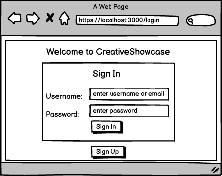
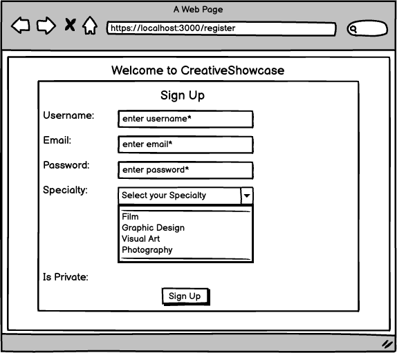
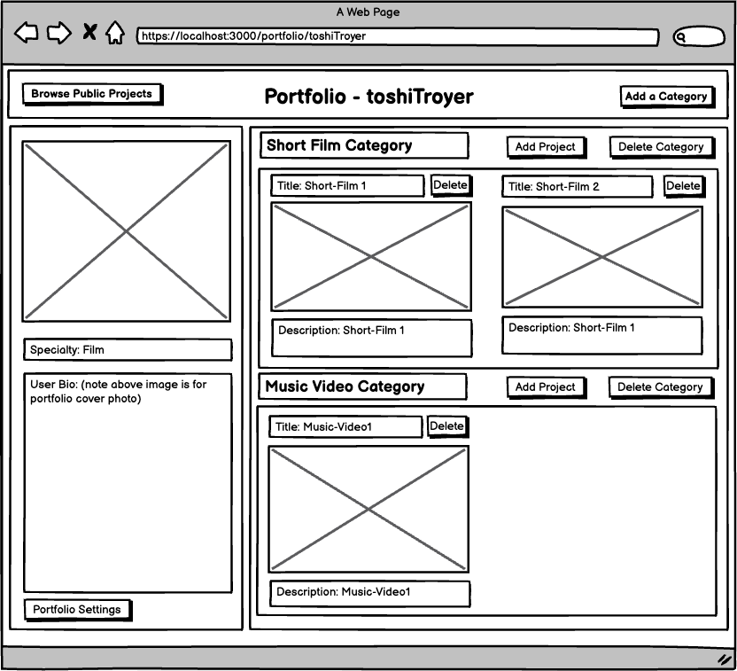
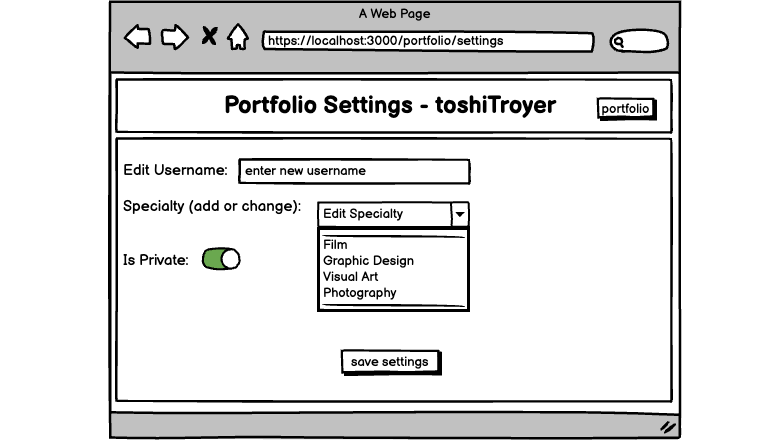
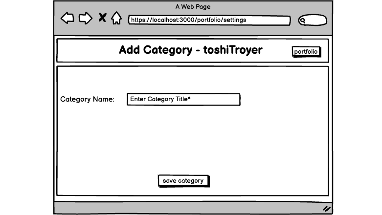
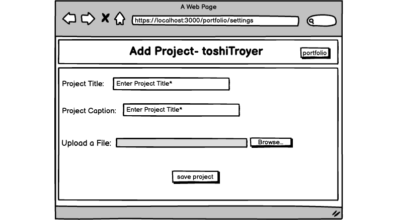
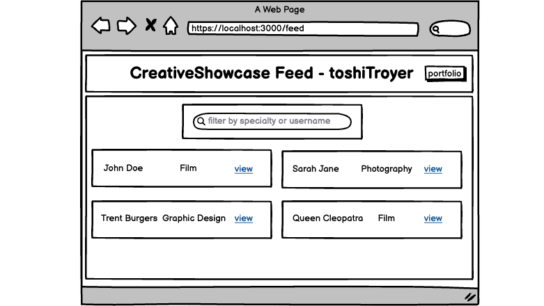
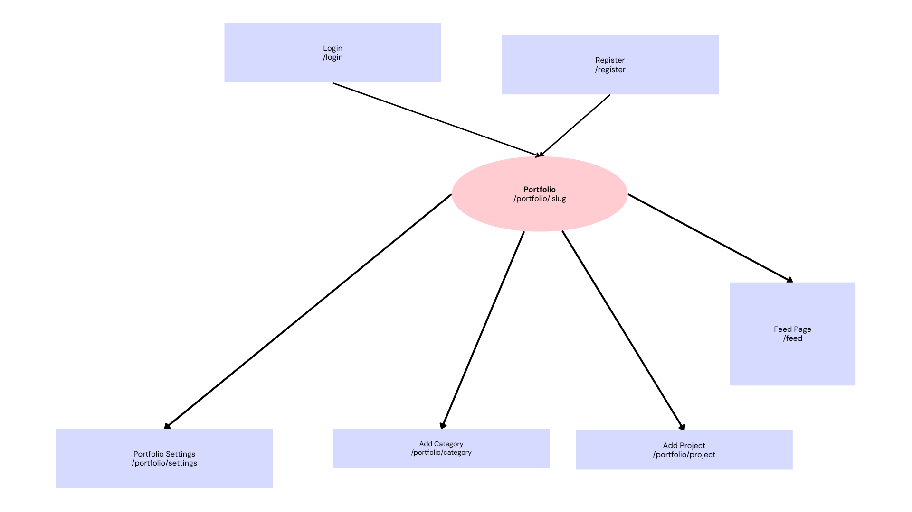

[](https://classroom.github.com/open-in-codespaces?assignment_repo_id=18790227)

# CreativeShowcase

## Overview
Creating professional portfolios is challenging and time-consuming for busy creative students who need to showcase their work to potential employers. Many default to social media platforms that aren't designed for professional presentation or resort to expensive website builders with steep learning curves. 

That's where CreativeShowcase comes in! CreativeShowcase is a web app that allows art, graphics, and design students to easily build polished portfolio websites without coding knowledge. Users can register and create their personal portfolio space with a custom URL. 
Once set up, they can upload projects, organize them into categories, and customize their portfolio's appearance. Visitors can browse public portfolios, allowing employers to discover emerging talent while giving students valuable exposure for their work.

## Data Model

The application will store Users, Portfolios, Categories, Settings and Projects

* Users can have one portfolio (via references)
* Portfolios can have many categories (via references) and one setting (by)
* Each category can have multiple projects (by embedding)

An Example User:
```javascript
{
  userName: "filmstudent22",
  hash: // a password hash,
  email: "student@university.edu",
  portfolio: // reference to a Portfolio document,
}
```
An Example Portfolio with Embedded Settings:

```javascript
{
  user: // reference to a User document,
  bio: "Film student specializing in documentary filmmaking",
  specialty: "Film",
  url: //from slug ie, based off userName
  portfolioSettings: {
    isPublic: true,
    //have not decided if I want to include user being able to choose Portfolio colors in proj scope
    customColorScheme: {
      primary: //chosen colors for background
      secondary: //could be chosen color for header tab
      accent: //chosen color of borders, etc
    }
  },
  categories: // array of references to Category documents,
}
```
An Example Category with Embedded Projects:
```javascript
{
  user: // reference to a User document,
  portfolio: // reference to a Portfolio document,
  name: "Short Films",
  projects: [{
    title: 'NYC Shortfilm',
    description:  'A short film about New York',
    projectContent: {
      contentType: 'video',
      content: //url to short film,
      caption: 'caption to uploaded film',
    }
    createdAt: // timestamp
    updatedAt: //timestamp
  }]
  createdAt: // timestamp
  updatedAt: //timestamp
}
```

## [Link to First Draft Schema](db.mjs) 

## Wireframes


/login - page for loggin in



/register - page for registering



/portfolio/slug - page for showing users specific portfolio



/portfolio/settings - settings page for users portfolio



/portfolio/category - page for adding a category to users portfolio



/portfolio/addproject?category=123 - page for adding a project to a category



/feed - page for user to see other users public portfolios



## Site Map



## Use Cases
1. As a non-registered user, I want to register a new account with the site so that I can begin building my creative portfolio.
2. As a user, I want to log in to the site so that I can securely access and update my portfolio.
3. As a creative professional, I want to create a portfolio with my bio and specialty so that visitors understand my background and expertise.
4. As an artist, I want to add categories to my portfolio so that I can organize my work by project type or medium.
5. As an artist, I want to upload projects to my categories so that I can display my art logically with descriptions and context.
6. As a hiring manager, I want to browse portfolios by specialty so that I can find artists with relevant skills.
7. As a student, I want to set my portfolio to public or private so that I can control when my work is ready to be viewed.
8. As a job-seeking creative, I want to share my portfolio URL so that potential employers can easily view my best work.

## Research Topics
* Next.js (6 points):
    * Next.js is a React framework that provides server-side rendering and an integrated routing system perfect for portfolio websites with custom URLs. It will enable the CreativeShowcase application to generate portfolio pages for each user with optimized image loading, which is crucial for displaying high-quality creative work efficiently. The file-system based router will also allow for clean /portfolio/[username] URL patterns. 
* tailwind.css (2 points):
    *  Tailwind CSS is a utility-first CSS framework that will enable custom portfolio themes without external API dependencies. Its pre-built classes will allow CreativeShowcase users to customize their portfolio's appearance through an abundance of color schemes and layouts. The framework's container queries and grid system will be especially valuable for creating responsive portfolio layouts that showcase projects effectively on all devices regardless of screen size.
* Passport.js (2 points):
    * Passport.js is a flexible authentication middleware for Node.js which will enable secure log in sessions in CreativeShowcase. It allows users to register and log in with a username and password using the LocalStrategy. Combined with express-session and MongoDB storage, Passport manages user sessions across routes and API calls. 


## [Link to Initial Main Project File](app.mjs) 

## Annotations / References Used
1. [Mongoose Schema Docs - For Timestamp](https://mongoosejs.com/docs/guide.html)
2. [Next.js Documentation](https://nextjs.org/)
3. [Tailwind CSS Documentation](https://tailwindcss.com/)
4. [Jest Documentation](https://jestjs.io/)

